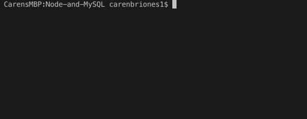
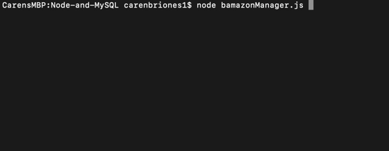
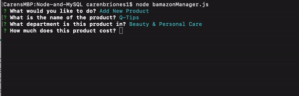
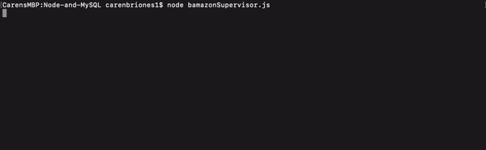
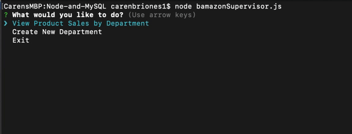

# Node-and-MySQL
Amazon-like storefront app created with the use of MySQL, Node, and Inquirer.

## Customer View
The customer is first presented with all items available in the database for them to order. They are then prompted to select an item that they want to buy.  Once they select an item, they are then asked to enter the number of units that they want to order. If there are not enough units of the specified item in the database, an "Insufficient quantity!" message will be displayed in the console.  

If there are enough units, the customer's order will go through, the total cost will be displayed, and the specified number of units will be removed from the product's stock quantity.  

## Manager View
The manager is first presented with the five commands they may execute: View Products for Sale, View Low Inventory, Add to Inventory, Add New Product, and Exit. If they choose "View Products for Sale," all products in the database will be logged to the console. 

If they choose "View Low Inventory," only the products with a stock quantity less than 5 will be displayed.  

 
"Add to Inventory" will display a list of all products, and the manager will be prompted to choose one, and will be asked how many of that product that they want to add to the database. The item's stock quantity will then be added to in the database. 

 
Choosing "Add New Product" will prompt the manager for an item's name, department name, price, and stock quantity, and the specified item will be added to the existing list of products.  

After any of the previous four commands are executed, the manager will return to the main menu where they will be prompted to choose one of the original five commands. In the case that the manager chooses "Exit," the application will end.

## Supervisor View
The supervisor is first presented with three commands to choose from: View Product Sales by Department, Create New Department, and Exit. If they choose "View Product Sales by Department," products will be grouped by department name, and product sales as well as total profit will be calculated based off of the department's overhead costs.  

If the supervisor chooses to create a new department, they will be prompted to enter the name of the department and the overhead costs. 

Once either of the two commands are executed, the supervisor will see the main menu, with the original three commands. If the supervisor chooses to "Exit," the application will end.